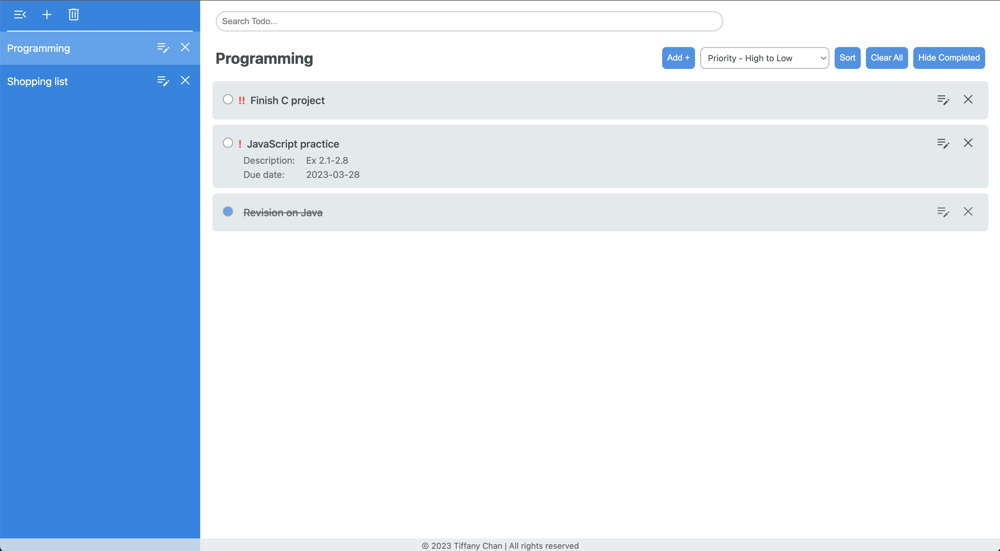
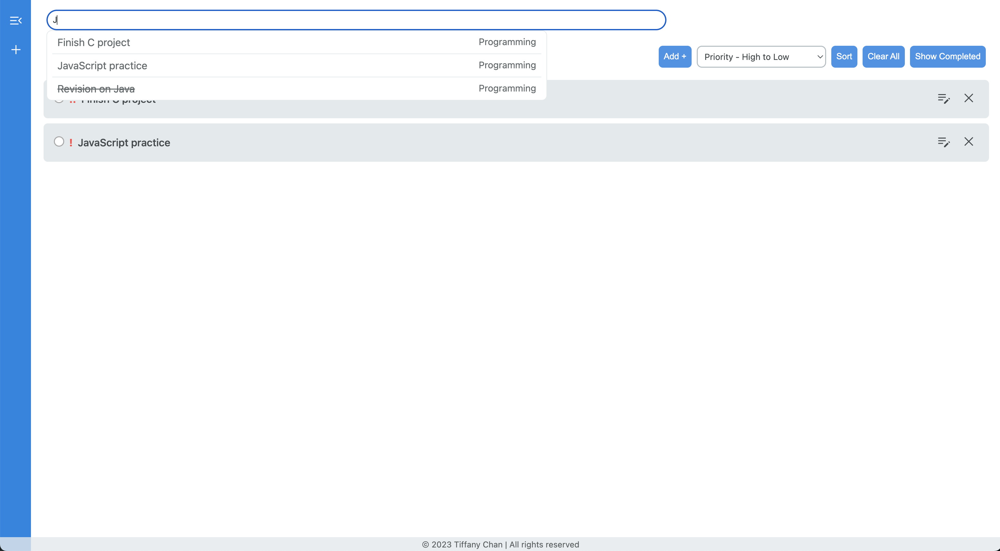
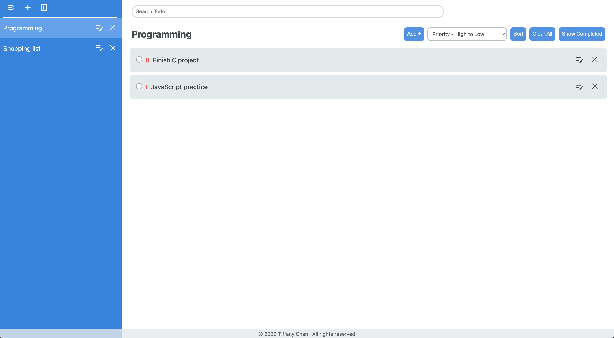

# Todo List

This is a simple todo list app inspired by The Odin Project - Todo list. I did this project to practice my skills in JavaScript that I learned from Web Scripting - Intro course in Fanshawe College. This project also allows me to explore more about DOM manipulation and how to use webpack to bundle my code.

## Live Demo

You can view my page here: [Todo List](https://tiffanychan614.github.io/odin-to-do-list/)

## Screenshots

## Built With

- HTML
- CSS
- JavaScript
- Webpack

## Skills Learned

- DOM manipulation
- Webpack
- ES6 Modules
- OOP design in JavaScript
- localStorage
- CSS Flexbox
- UI design

## Features

- You can add, edit, and delete a project and a todo item.
- You can write a description, due date, and priority for a todo item.
- You can view a todo item's details by clicking on it.
- You can sort todo items by due date, priority, date created, or title.
- You can mark a todo item as completed.
- You can toggle between showing completed todo items or hiding them.
- You can view all todo items or todo items by project.
- You can minimize the sidebar
- You can search for todo items by title.
- Todo items are saved in localStorage.
